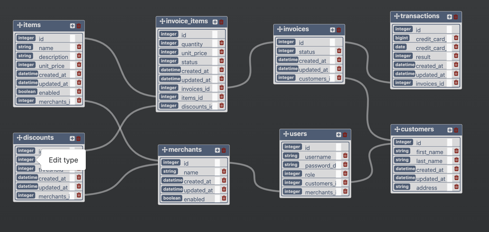

# Little Esty Shop

## Background and Description

"Little Esty Shop" is a group project that requires students to build a fictitious e-commerce platform where merchants and admins can manage inventory and fulfill customer invoices. Project requirements can be found here:
https://github.com/turingschool-examples/little-esty-shop

Additionally, students were asked to add additional functionality to allow merchants to apply bulk discounts to their items. Details for this extension are available here:
https://backend.turing.io/module2/projects/bulk_discounts

## Goals accomplished
- Setup normalized database with one to many and many to many relationships
- Setup custom rake task to seed the database
- Utilize advanced active record techniques to perform complex database queries
- Created a service class and poros search to consume GitHub API
- Webmock is used to mock API tests
- Edge cases were added to enhance testing
- Use of application helpers, callbacks, and scopes to DRY code
- Extensive refactor of app and tests to accommodate database changes
- Deployed application to [Heroku](https://dashboard.heroku.com/apps/little-esty-shop-m2)
  * note: to view admin pages, log in using these credentials:
    username: admin
    password: admin
  * to view merchant pages, log in using these credentials:
    username: merchant_1 OR merchant_2 OR merchant_3
    password: merchant
  * to view customer pages or to submit an order, log in using these credentials:
    username: customer
    password: customer

Additionally, the following were not required but were implemented:
- User authentication and basic page view authorization
- Basic shopping cart functionality
- Styling using Bootstrap framework
- Caching of information acquired via GitHub's API

### Future improvements:
- functionality to view shopping cart contents and order history
- functionality to create customer and merchant accounts, and for merchants and customers to edit their profile information
- refactor API functionality to make better use of POROs
- refactor ActiveRecord methods to combine similar queries used by different models

## Database Scheme

## Technologies
- Ruby v.2.5.3
- Ruby on Rails 5.2.4
### Utilities
- rspec-rails
- factory_bot_rails
- faker
- simplecov
- webmock
- bootstrap

## Contributors
[Gus Cunningham](https://github.com/cunninghamge)
[Grayson Myers](https://github.com/GrayMyers)
[Max Ribbans](https://github.com/ribbansmax)
[Joe Jiang](https://github.com/ninesky00)
